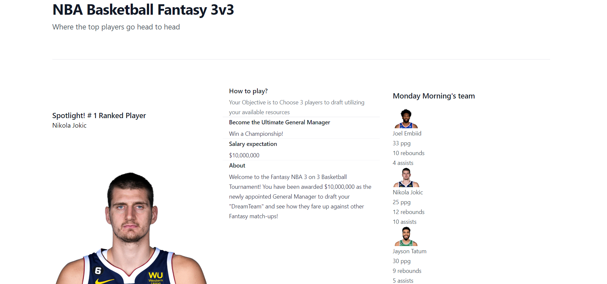

# sports-forum

## Our Task

Being a sports fan can be a full-time job for those who really dive deep into the fine details. Sports enthusiast devote many hours and days formulating their ideologies and debating amongst each other about best players, best teams, and best stats and etc. It is important to note that these opinions can not necessarily as currently constructed be verified.

Our task was to build a tournament style application where the user becomes the general manager and is given the resources to design your dream team. With use of Node.js, Handlebars.js, MySQL, and a newly implemented css framework(Tailwindcss), we have created a application where users can create an account, store their data, analyze player stats, create a team, and see the team displayed on their dashboard and homepage. 

## User Story

```md
As sports enthusiasts who are also developers
WE WANT to make an interactive fantasy basketball league where players can be chosen based on stats and added to a team
SO THAT everyday opinions can be put to the test
```

## Acceptance Criteria
```
GIVEN a sports-forum for fantasy basketball
WHEN I land on the site as a first time visitor
THEN I am presented the homepage where other users' teams are viewable if there are pre-existing entries; in the navigation bar I can see a homepage link as well as a login link
WHEN I click the homepage button 
THEN I remain on the homepage
WHEN I click on the log in button
THEN I am brought to a page where I am prompted to either log in or sign up
WHEN I choose the login in form without already being signed up 
THEN an alert appears indicated a bad request
WHEN I choose to fill out the sign up form 
THEN I am logged in after providing a name, email, and password
WHEN I am logged in I am now presented with a dashboard that is labeled as profile
THEN I am given a form where I can create a title as well as a description for all of the content I want to discuss
```

## Getting Started

Our application’s folder structure follows the Model-View-Controller paradigm. We have used the [express-handlebars](https://www.npmjs.com/package/express-handlebars) package to implement Handlebars.js for my Views, the [MySQL2](https://www.npmjs.com/package/mysql2) and [Sequelize](https://www.npmjs.com/package/sequelize) packages to connect to a MySQL database for our Models, and created an Express.js API for our Controllers.


We have also included [dotenv package](https://www.npmjs.com/package/dotenv) to use environment variables, the [bcrypt package](https://www.npmjs.com/package/bcrypt) to hash passwords, and the [express-session](https://www.npmjs.com/package/express-session) and [connect-session-sequelize](https://www.npmjs.com/package/connect-session-sequelize) packages to add authentication.

**Important**: The [express-session](https://www.npmjs.com/package/express-session) package stores the session data on the client in a cookie. When the user is idle on the site for more than a set time, the cookie will expire and they are logged out and required to log in again to start a new session. This is the default behavior and this is due to the nature of implementing the npm package.


## Review

This section is here to highlight the required elements needed for review:

* Our application which has been deployed though the usage of Heroku:

Refer to this [Heroku Deployed Application](https://sports-forum-6b7ede8e5d19.herokuapp.com/) to view the functionality of this creation
    

* The URL to our SportsForum GitHub repository, with a unique name and this README to describe the project:

Refer to this link [GitHub Repository](https://github.com/dylanstoudt/sports-forum) to view and explore the GitHub repo for this assignment


## Screenshots

The following images show the results of this application's development phase:




